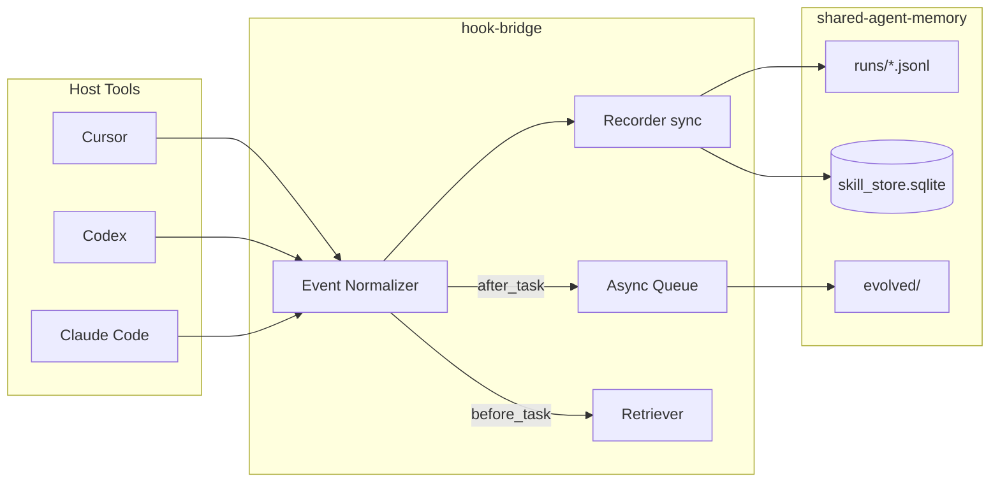

# Foundry Architecture

Foundry is a lightweight Node.js hook bridge that normalizes agent lifecycle events across **Cursor**, **Codex**, and **Claude Code**, records them to JSONL + SQLite, and evolves reusable skills through a human-gated promote pipeline.

## Data Layout

```
${FOUNDRY_MEMORY_ROOT}/          # default ~/.foundry/
└── shared-agent-memory/
    ├── runs/                    # {tool}/{date}/{session-id}.jsonl
    ├── evolved/                 # FIX|DERIVED|CAPTURED drafts
    ├── queue/                   # async analyze jobs
    ├── agents/                  # agent execution logs
    └── skill_store.sqlite

<project>/.foundry/runs/         # project overlay (optional)
```

## Event Flow



## Normalized Events

| Event | Cursor | Codex | Claude Code |
|-------|--------|-------|-------------|
| `before_task` | `beforeSubmitPrompt` | `UserPromptSubmit` / `SessionStart` | `SessionStart` |
| `after_edit` | `afterFileEdit` | `PostToolUse` (edit) | `PostToolUse` (Edit/Write) |
| `after_command` | `afterShellExecution` | `PostToolUse` (shell) | `PostToolUse` (Bash) |
| `after_task` | `stop` | `Stop` | `Stop` |

## Five Agents

| Agent | Phase 1 | Phase 2+ |
|-------|---------|----------|
| **Recorder** | Sync JSONL + SQLite | Same |
| **Retriever** | Keyword search skills + sqlite tags | Optional embeddings |
| **Analyzer** | `foundry analyze --session` | Queue worker on `after_task` |
| **Evolver** | Rule-based CAPTURED templates | LLM FIX/DERIVED |
| **Validator** | Frontmatter + security + provenance | + LLM review |

## Skill Taxonomy

- **CAPTURED** — workflow extracted from successful run
- **DERIVED** — specialization of parent skill
- **FIX** — correction patch to existing skill

Drafts live in `evolved/{TYPE}/{slug}/` with:
- `SKILL.md`
- `.provenance.json` (ECC-aligned)
- `PROMOTE.diff`

## Security Boundaries

| Rule | Implementation |
|------|----------------|
| Hooks cannot read `.env` | `security.mjs` denylist |
| No cloud upload | No upload client in codebase |
| evolved/ cannot overwrite skills/ | Validator path check; promote = copy |
| Promoted skills need git diff | `foundry promote` runs `git diff` |
| Prompt injection scan | `scanSkillContent()` in validator |
| Hook timeouts | Cursor: 3–5s per `hooks.json` |
| Runs retention | 90-day archive policy (manual/CI) |
| Slug format validation | `validateSlug()` — `^[a-z0-9][a-z0-9-]{0,63}$` on all slug args |
| Path escape prevention | `assertPathWithinRoot()` on promote source/dest |
| Custom skills root guard | `assertSkillsRootAllowed()`; override via `--force` or `FOUNDRY_ALLOW_CUSTOM_SKILLS_ROOT=1` |
| Shell injection prevention | `git.mjs` uses `spawnSync` with `shell: false`; slug validated before `git diff` |
| Sensitive file permissions | `chmod 600` on `skill_store.sqlite` and run JSONL on write |
| Hook adapter resilience | Cursor/Codex/Claude adapters fail-open (exit 0) on stdin JSON parse errors |
| CAPTURED command redaction | `sanitizeCommand()` re-applies `redactString()` + `scanSkillContent()` in evolver |

## SQLite Schema

- `sessions` — session metadata
- `events` — JSONL index
- `skills` — slug, state, reuse_count, success_rate
- `lineage` — parent/child evolution DAG
- `evolution_queue` — async analyze jobs
- `knowledge_entries` — short memory / user profile index (v2)
- `experiences` — extracted lessons from sessions (v2)
- `skill_versions` — per-slug version chain linked to `.foundry/versions/` (v2)

Skill directories under `FOUNDRY_SKILLS_ROOT` (default `~/.claude/skills`) may include:

```
{slug}/SKILL.md
{slug}/.foundry/manifest.json
{slug}/.foundry/versions/v{N}/SKILL.md
```

Body files for knowledge and experiences live under `~/.foundry/knowledge/` and `~/.foundry/experiences/`.

## Integration

### skill-mnemo

Mnemo handles **round-level memory recall** (USER.md, MEMORY.md). Foundry handles **durable reusable skills**. They chain independently on Codex hooks.

### Superset

Foundry adapters call `~/.superset/hooks/cursor-hook.sh` and `notify.sh` after recording. Existing Superset notifications are preserved.

### ECC Provenance

`.provenance.json` follows the ECC schema: `source`, `created_at`, `confidence`, `author`.

## CLI Reference

```
foundry status
foundry audit
foundry install-hooks cursor|codex|claude [--target <path>]
foundry analyze --session <id>
foundry apply <slug> [--type CAPTURED|FIX|DERIVED] [--draft <slug>] [--parent <slug>] [--force]
foundry promote <slug>   (alias for apply)
foundry adopt [--dry-run] [--slug <name>]
foundry history <slug>
foundry diff <slug> [--from vN] [--to current|vN]
foundry rollback <slug> --to vN [--force]
foundry review
foundry migrate-mnemo [--dry-run] [--path <dir>]
foundry migrate-auto-skill [--dry-run] [--path <dir>]
foundry queue-worker [--once]
foundry archive [--days 90] [--dry-run]
foundry autopromote [--dry-run]
foundry simulate-recorder
```

### `apply` / `promote` flags

| Flag | Description |
|------|-------------|
| `--type CAPTURED\|FIX\|DERIVED` | Evolution type (default: `CAPTURED`) |
| `--draft <slug>` | Draft slug under `evolved/{TYPE}/` when different from target |
| `--parent <slug>` | Required for `DERIVED` — parent skill slug |
| `--force` | Override locked skills or custom skills root guard |

### Environment (security-related)

| Variable | Default | Description |
|----------|---------|-------------|
| `FOUNDRY_SKILLS_ROOT` | `~/.claude/skills` | Canonical skills directory |
| `FOUNDRY_ALLOW_CUSTOM_SKILLS_ROOT` | unset | Set to `1` to skip `assertSkillsRootAllowed()` checks |

### Tests

```bash
npm test   # unit tests in packages/hook-bridge/*.test.mjs
```

## Phase Roadmap

- **Phase 0** — Recorder + Cursor + CLI status/audit
- **Phase 1** — All adapters + analyze + promote
- **Phase 2** — Retriever injection + queue worker
- **Phase 3** — Low-risk autopromote to staging + quality metrics
